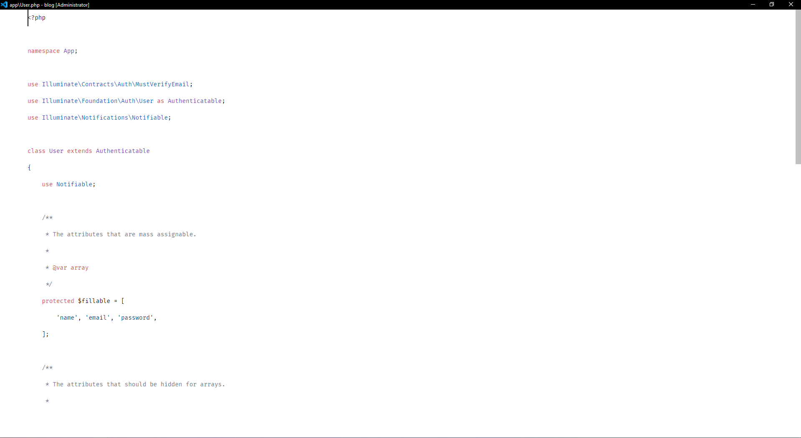

# Minimal VSCode Setup

## Font
[Fira Code](https://github.com/tonsky/FiraCode/): free monospaced font with programming ligatures

## Required Extensions
- [Customize UI](https://marketplace.visualstudio.com/items?itemName=iocave.customize-ui)
- [Monkey Patch](https://marketplace.visualstudio.com/items?itemName=iocave.monkey-patch)
- [Disable Ligatures](https://marketplace.visualstudio.com/items?itemName=CoenraadS.disableligatures)